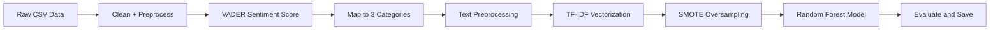

# Sentiment Analysis Pipeline using VADER + TF-IDF + Random Forest

This project implements a complete sentiment analysis pipeline on textual data using a combination of rule-based and machine learning techniques. It performs cleaning, sentiment generalization, vectorization, model training, evaluation, and prediction.

---

## Table of Contents

- [ Dataset](#-dataset)
- [ Workflow](#️-workflow)
- [Requirements](#-requirements)
- [Step-by-Step Process](#-step-by-step-process)
  - [1️⃣ Load and Prepare Data](#1️⃣-load-and-prepare-data)
  - [2️⃣ Sentiment Categorization using VADER](#2️⃣-sentiment-categorization-using-vader)
  - [3️⃣ Text Preprocessing](#3️⃣-text-preprocessing)
  - [4️⃣ Vectorization and Model Training](#4️⃣-vectorization-and-model-training)
  - [5️⃣ Model Evaluation](#5️⃣-model-evaluation)
  - [6️⃣ Predict on New Data](#6️⃣-predict-on-new-data)
  - [7️⃣ Save Model Artifacts](#7️⃣-save-model-artifacts)
- [Example Output](#-example-output)
- [Folder Structure](#-folder-structure)
- [Notes](#-notes)

---

## Dataset

- Format: CSV
- Columns:
  - `Text`: The input text.
  - `Sentiment`: Original sentiment (can be noisy or varied).
- Size: 1907 records

---

## Workflow


---

## Requirements

Install the following Python libraries:

```bash
pip install pandas scikit-learn nltk imbalanced-learn joblib
```

Download NLTK resources:

```python
import nltk
nltk.download('stopwords')
nltk.download('punkt')
nltk.download('wordnet')
nltk.download('vader_lexicon')
```

---

## Step-by-Step Process

### 1️⃣ Load and Prepare Data

* Load CSV using pandas
* Strip whitespace from `Sentiment` labels
* Create a working copy for processing

```python
# ==============================================
# STEP 1: DATA LOADING AND INITIAL PREPARATION
# ==============================================
df = pd.read_csv("path/to/training_data.csv")
df.info()
df.head()

# Clean data
df['Sentiment'] = df['Sentiment'].map(lambda x: str(x).strip())

# Create working copy
cdf = df.copy()
```
### 2️⃣ Sentiment Categorization using VADER

* Use NLTK's `SentimentIntensityAnalyzer` to score each unique label
* Define thresholds:

  * Positive ≥ 0.35
  * Neutral between -0.20 and 0.35
  * Negative ≤ -0.20
* Map raw labels to `"Positive"`, `"Neutral"`, or `"Negative"`

```python
# ==============================================
# STEP 2: SENTIMENT CATEGORIZATION USING VADER
# ==============================================

sia = SentimentIntensityAnalyzer()

# Get all unique sentiments
all_sentiment_words = cdf['Sentiment'].unique().tolist()

# Calculate sentiment scores
sentiment_scores = {word: sia.polarity_scores(word)['compound'] for word in all_sentiment_words}

# Define thresholds
pos_threshold = 0.35
neg_threshold = -0.20

# Categorize sentiments
pos_words = [word for word, score in sentiment_scores.items() if score >= pos_threshold]
neg_words = [word for word, score in sentiment_scores.items() if score <= neg_threshold]
neu_words = [word for word, score in sentiment_scores.items() if neg_threshold < score < pos_threshold]

# Replace with generalized sentiments
cdf['Sentiment'] = cdf['Sentiment'].map(lambda x: "Positive" if x in pos_words else x)
cdf['Sentiment'] = cdf['Sentiment'].map(lambda x: "Negative" if x in neg_words else x)
cdf['Sentiment'] = cdf['Sentiment'].map(lambda x: "Neutral" if x in neu_words else x)

# Verify 3 categories
print("\nUnique Sentiments After Generalization:", cdf['Sentiment'].nunique())
print(cdf['Sentiment'].value_counts())
```

### 3️⃣ Text Preprocessing

* Lowercase all text
* Remove punctuation and digits
* Tokenize using `word_tokenize()`
* Remove English stopwords
* Apply stemming via `PorterStemmer`

```python
# ==============================================
# STEP 3: TEXT PREPROCESSING
# ==============================================
def clean_text(text):
    if not isinstance(text, str):
        return ""
    
    text = re.sub(r'[^a-zA-Z\s]', '', text)
    text = text.lower()
    tokens = word_tokenize(text)
    stop_words = set(stopwords.words('english'))
    tokens = [token for token in tokens if token not in stop_words]
    stemmer = PorterStemmer()
    tokens = [stemmer.stem(token) for token in tokens]
    return ' '.join(tokens)

cdf['Processed_Text'] = cdf['Text'].astype(str).apply(clean_text)
```
### 4️⃣ Vectorization and Model Training

* Vectorize processed text using `TfidfVectorizer`
* Split into training and test sets (80/20)
* Use `SMOTE` to balance classes
* Train a `RandomForestClassifier` with 150 trees and `class_weight="balanced"`

```python
# ==============================================
# STEP 4: VECTORIZATION AND MODEL TRAINING
# ==============================================
tfidf_vectorizer = TfidfVectorizer()
X = tfidf_vectorizer.fit_transform(cdf['Processed_Text'])
y = cdf['Sentiment']

# Train-test split (for evaluation)
X_train, X_test, y_train, y_test = train_test_split(X, y, test_size=0.2, random_state=42)

# Handle class imbalance
smote = SMOTE(random_state=42)
X_resampled, y_resampled = smote.fit_resample(X_train, y_train)

# Train model
model = RandomForestClassifier(n_estimators=150, class_weight='balanced', random_state=42)
model.fit(X_resampled, y_resampled)
```

### 5️⃣ Model Evaluation

* Predict on test data
* Show:

  * Classification report
  * Confusion matrix
  * Stratified 5-fold cross-validation accuracy

```python
# ==============================================
# STEP 5: MODEL EVALUATION
# ==============================================
y_pred = model.predict(X_test)

print("\nClassification Report:")
print(classification_report(y_test, y_pred))
print("\nConfusion Matrix:")
print(confusion_matrix(y_test, y_pred))

# Cross-validation
cv = StratifiedKFold(n_splits=5, shuffle=True, random_state=42)
scores = cross_val_score(model, X, y, cv=cv, scoring='accuracy')
print("\nCross-Validation Scores:", scores)
print("Mean Accuracy:", np.mean(scores))
```

Example:

```text
Precision | Recall | F1 | Support
--------------------------------
Negative | 0.78 | 0.82 | 0.80 | 125
Neutral  | 0.76 | 0.74 | 0.75 | 125
Positive | 0.88 | 0.86 | 0.87 | 132
Accuracy: 81%
```

### 6️⃣ Predict on New Data

```python
predict_on_new_data(
    test_file_path="path/to/test.csv",
    output_file_path="path/to/save.csv"
)
```

* The input CSV should contain a `Text` column.
* Outputs a `Predicted_Sentiment` column.


## Example Output

```text
Sample Predictions:
-----------------------------------------------------
Text                                             | Sentiment
-----------------------------------------------------  
"Wildfires like those in California..."          | Negative  
"From a management perspective..."               | Neutral  
"Climate response has improved..."               | Positive  
```


---

## Notes

* Sentiment thresholds can be adjusted if needed to suit the case.
---

## ✨ Author

Made By Vaishali, Sana, Smriti, Vedant, Darshan

